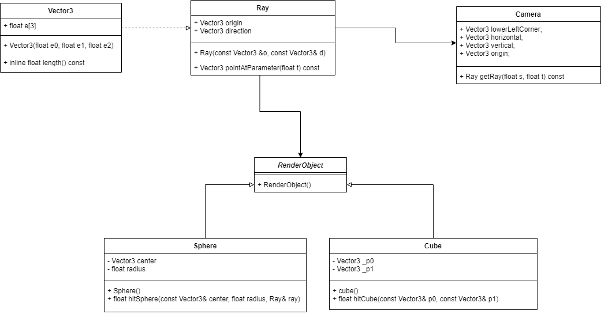

# ThreadedRayTracer
This repository contains a parallelized version of the raytracer implementation from the "Raytracing in one weekend" guide, witten by Peter Shirley.
The program does not utilize any external libraries, and should be compatible with Windows, Linux and Mac OS (the latter being verified working). 
The `run.sh` script however, does contain some linux specific tooling that is being used to convert the generated scenes to portable `.png` images.

## Workings
The raytracer itself resides within `main` and uses the `RenderObject` to spawn a `Sphere` or `Cube` object. A `Ray` class is being used to generate the lightning within the scene.
Furthermore, there is a `Vector3` class that provides a 3d vector object that is used in conjunction with linear algebra operator overloads that reside within `linAlg.hpp`.
Finally, `debug.hpp` provides a debug macro that when turned on, provides some diagnostic info of the program in runtime. The raytracer makes use of hardware concurrency and creates a thread pool with a size based on the amount of available hardware threads of your computer. It then sends 10 jobs to each thread and combines them back to one at the end. A `pixelBuffer` object keeps track of each current pixel being drawn and when done, is written to a `.ppm` file. The program uses line arguments so that resolution, sample amount and a filename can be changed dynamically.

## Script 
A script called `run.sh` is being provided in order to easily run the program. The script asks for resolution, sample amount and a filename to store the image to and passes these to the program. If the rendering is finished, the script then converts the generated image from `.ppm` to the more compatible `.png` extension and finally displays the image.

### Required packages
* imagemagick, to convert the images
* eog, to show the final image

